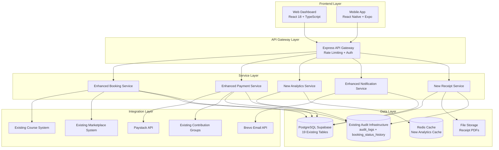

# Design Document: Farmle Platform Enhancement

## Overview

The Farmle platform enhancement introduces comprehensive improvements to the agro-career management system, focusing on user experience, operational efficiency, and platform scalability. This design addresses critical gaps in booking management, payment processing, analytics, and cross-platform integration while maintaining the existing technology stack and database schema.

### Key Enhancement Areas

- **Enhanced User Experience**: Card-based dashboard layouts, intuitive navigation, and mobile-first design
- **Operational Excellence**: Automated payment recovery, comprehensive analytics, and audit trails
- **Platform Integration**: Seamless connection between booking, courses, marketplace, and contribution systems
- **Scalability & Security**: Performance optimization, security hardening, and compliance measures

### Design Principles

1. **Backward Compatibility**: All enhancements maintain compatibility with existing data and APIs
2. **Progressive Enhancement**: Features degrade gracefully for older clients and limited connectivity
3. **Mobile-First**: All interfaces designed primarily for mobile usage patterns
4. **Data Integrity**: Comprehensive audit trails and transaction safety
5. **User-Centric**: Interface decisions driven by farmer and property owner workflows

## Architecture

### System Architecture Overview



### Enhanced Database Schema

Based on the current database audit, the design extends the existing schema with new tables and columns while maintaining backward compatibility. The current database already has comprehensive audit capabilities with `audit_logs` and `booking_status_history` tables.

#### Current Database State Analysis

**Existing Tables (19 total):**
- `bookings` - Core booking table with comprehensive fields including `cancelled_by`, `cancelled_at`, `payment_reference`, `notes`, `rejection_reason`, `deleted_at`
- `booking_status_history` - Already exists for audit trail with `booking_id`, `old_status`, `new_status`, `changed_by`, `reason`
- `audit_logs` - General audit logging with `user_id`, `action`, `resource_type`, `resource_id`, `details`, `ip_address`
- `refunds` - Already exists with `booking_id`, `amount`, `reason`, `status`, `payment_reference`, `processed_at`
- Other platform tables: `users`, `properties`, `courses`, `products`, `groups`, `farm_records`, etc.

**Current Booking Status Values in Use:**
- Status: `pending_payment`, `pending`, `confirmed`, `cancelled`, `completed` (CHECK constraint exists)
- Payment Status: `pending`, `paid`, `failed` (CHECK constraint exists)
- Current data: 7 paid bookings, 4 pending payments

**Existing Indexes and Triggers:**
- Comprehensive indexing on booking fields (`status`, `payment_status`, `farmer_id`, `property_id`, `dates`)
- Automatic audit logging via `booking_status_change_trigger`
- Overlap prevention via `bookings_no_overlap` GiST index
- Automatic `updated_at` timestamp updates

#### Required Database Enhancements

```sql
-- Enhanced bookings table (add missing columns for new features)
ALTER TABLE bookings ADD COLUMN IF NOT EXISTS payment_retry_count INTEGER DEFAULT 0;
ALTER TABLE bookings ADD COLUMN IF NOT EXISTS payment_timeout_at TIMESTAMP WITH TIME ZONE;

-- Add indexes for new functionality
CREATE INDEX IF NOT EXISTS idx_bookings_payment_retry ON bookings(payment_retry_count) WHERE payment_retry_count > 0;
CREATE INDEX IF NOT EXISTS idx_bookings_timeout ON bookings(payment_timeout_at) WHERE payment_timeout_at IS NOT NULL;

-- New analytics cache table (for performance optimization)
CREATE TABLE IF NOT EXISTS analytics_cache (
    id UUID PRIMARY KEY DEFAULT gen_random_uuid(),
    cache_key VARCHAR(255) UNIQUE NOT NULL,
    data JSONB NOT NULL,
    expires_at TIMESTAMP WITH TIME ZONE NOT NULL,
    created_at TIMESTAMP WITH TIME ZONE DEFAULT NOW()
);

CREATE INDEX IF NOT EXISTS idx_analytics_cache_key ON analytics_cache(cache_key);
CREATE INDEX IF NOT EXISTS idx_analytics_cache_expires ON analytics_cache(expires_at);

-- New communication log table (for in-app messaging)
CREATE TABLE IF NOT EXISTS booking_communications (
    id UUID PRIMARY KEY DEFAULT gen_random_uuid(),
    booking_id UUID REFERENCES bookings(id) ON DELETE CASCADE,
    sender_id UUID REFERENCES users(id) ON DELETE CASCADE,
    recipient_id UUID REFERENCES users(id) ON DELETE CASCADE,
    message_type VARCHAR(50) NOT NULL CHECK (message_type IN ('booking_inquiry', 'booking_update', 'payment_reminder', 'cancellation_notice', 'general')),
    subject TEXT,
    content TEXT NOT NULL,
    read_at TIMESTAMP WITH TIME ZONE,
    sent_at TIMESTAMP WITH TIME ZONE DEFAULT NOW()
);

CREATE INDEX IF NOT EXISTS idx_communications_booking ON booking_communications(booking_id);
CREATE INDEX IF NOT EXISTS idx_communications_sender ON booking_communications(sender_id);
CREATE INDEX IF NOT EXISTS idx_communications_recipient ON booking_communications(recipient_id);
CREATE INDEX IF NOT EXISTS idx_communications_unread ON booking_communications(recipient_id, read_at) WHERE read_at IS NULL;

-- New receipt records table (for PDF receipt generation)
CREATE TABLE IF NOT EXISTS payment_receipts (
    id UUID PRIMARY KEY DEFAULT gen_random_uuid(),
    booking_id UUID REFERENCES bookings(id) ON DELETE CASCADE,
    payment_reference VARCHAR(255) NOT NULL,
    receipt_number VARCHAR(100) UNIQUE NOT NULL,
    amount DECIMAL(10,2) NOT NULL,
    currency VARCHAR(3) DEFAULT 'NGN',
    generated_at TIMESTAMP WITH TIME ZONE DEFAULT NOW(),
    pdf_url TEXT,
    qr_code TEXT
);

CREATE INDEX IF NOT EXISTS idx_receipts_booking ON payment_receipts(booking_id);
CREATE INDEX IF NOT EXISTS idx_receipts_payment_ref ON payment_receipts(payment_reference);
CREATE UNIQUE INDEX IF NOT EXISTS idx_receipts_number ON payment_receipts(receipt_number);

-- Enhanced analytics views for performance
CREATE OR REPLACE VIEW booking_analytics AS
SELECT 
    p.id as property_id,
    p.title as property_title,
    p.owner_id,
    COUNT(b.id) as total_bookings,
    COUNT(CASE WHEN b.status = 'confirmed' THEN 1 END) as confirmed_bookings,
    COUNT(CASE WHEN b.status = 'cancelled' THEN 1 END) as cancelled_bookings,
    COUNT(CASE WHEN b.status = 'pending_payment' THEN 1 END) as pending_payment_bookings,
    SUM(CASE WHEN b.payment_status = 'paid' THEN b.total_amount ELSE 0 END) as total_revenue,
    SUM(CASE WHEN b.status = 'pending' AND b.payment_status = 'paid' THEN b.total_amount ELSE 0 END) as pending_revenue,
    AVG(CASE WHEN b.status IN ('confirmed', 'completed') THEN b.end_date - b.start_date END) as avg_booking_duration,
    ROUND(
        COUNT(CASE WHEN b.status = 'cancelled' THEN 1 END)::DECIMAL / 
        NULLIF(COUNT(b.id), 0) * 100, 2
    ) as cancellation_rate
FROM properties p
LEFT JOIN bookings b ON p.id = b.property_id AND b.deleted_at IS NULL
WHERE p.is_active = true
GROUP BY p.id, p.title, p.owner_id;

-- Function to generate unique receipt numbers
CREATE OR REPLACE FUNCTION generate_receipt_number() RETURNS TEXT AS $$
DECLARE
    receipt_num TEXT;
    counter INTEGER := 1;
BEGIN
    LOOP
        receipt_num := 'RCP-' || TO_CHAR(NOW(), 'YYYYMMDD') || '-' || LPAD(counter::TEXT, 4, '0');
        
        IF NOT EXISTS (SELECT 1 FROM payment_receipts WHERE receipt_number = receipt_num) THEN
            RETURN receipt_num;
        END IF;
        
        counter := counter + 1;
    END LOOP;
END;
$$ LANGUAGE plpgsql;

-- Trigger to auto-generate receipt numbers
CREATE OR REPLACE FUNCTION auto_generate_receipt_number() RETURNS TRIGGER AS $$
BEGIN
    IF NEW.receipt_number IS NULL THEN
        NEW.receipt_number := generate_receipt_number();
    END IF;
    RETURN NEW;
END;
$$ LANGUAGE plpgsql;

CREATE TRIGGER receipt_number_trigger
    BEFORE INSERT ON payment_receipts
    FOR EACH ROW
    EXECUTE FUNCTION auto_generate_receipt_number();
```

#### Database Enhancement Notes

1. **Leveraging Existing Infrastructure**: The current database already has robust audit trails (`booking_status_history`, `audit_logs`) and refund handling (`refunds` table), so we build upon these rather than duplicating functionality.

2. **Backward Compatibility**: All new columns use `IF NOT EXISTS` and have sensible defaults to ensure zero downtime deployment.

3. **Performance Optimization**: New indexes target specific query patterns for analytics and filtering. The `booking_analytics` view pre-computes common metrics.

4. **Data Integrity**: Foreign key constraints with `ON DELETE CASCADE` ensure referential integrity. Check constraints validate enum values.

5. **Current Data Patterns**: With only 11 total bookings (7 paid, 4 pending), the system is in early stages, making this the perfect time for enhancements.

6. **Existing Triggers**: The `booking_status_change_trigger` already logs status changes, so our enhancements integrate with existing audit mechanisms.

### Service Architecture

#### Booking Service Enhancement
- **Responsibility**: Core booking lifecycle management with enhanced status tracking
- **Key Features**: Cancellation workflows, payment retry logic, integration with existing audit trails
- **Dependencies**: Payment Service, Notification Service, existing audit infrastructure
- **Integration Points**: Leverages existing `booking_status_history` and `audit_logs` tables

#### Analytics Service (New)
- **Responsibility**: Real-time analytics computation and caching using existing data
- **Key Features**: Occupancy calculations, revenue analytics, trend analysis
- **Dependencies**: Existing booking data, Redis Cache, `booking_analytics` view
- **Performance**: Sub-second response times through intelligent caching and pre-computed views
- **Data Sources**: Integrates with existing `bookings`, `properties`, `refunds` tables

#### Enhanced Notification Service
- **Responsibility**: Extend existing email notifications with in-app messaging
- **Key Features**: Payment reminders, booking updates, cancellation notices
- **Dependencies**: Existing Brevo integration, new `booking_communications` table
- **Integration**: Works with existing audit trails to trigger contextual notifications

#### Receipt Generation Service (New)
- **Responsibility**: PDF receipt generation and management
- **Key Features**: Automatic receipt creation, QR code generation, email delivery
- **Dependencies**: Existing payment data, new `payment_receipts` table
- **Integration**: Triggered by existing payment completion events

## Components and Interfaces

### Enhanced Dashboard Components

#### BookingCard Component
```typescript
interface BookingCardProps {
  booking: EnhancedBooking;
  onCancel: (bookingId: string, reason: string) => void;
  onRetryPayment: (bookingId: string) => void;
  onDownloadReceipt: (bookingId: string) => void;
  onMessageOwner: (ownerId: string, bookingId: string) => void;
}

interface EnhancedBooking extends Booking {
  property_image_url?: string;
  owner_contact_info?: ContactInfo;
  payment_retry_count: number;
  cancellation_reason?: string;
  audit_trail: AuditEntry[];
}
```

#### BookingStatusTimeline Component
```typescript
interface TimelineStep {
  status: BookingStatus;
  label: string;
  completed: boolean;
  timestamp?: Date;
  icon: React.ComponentType;
}

interface BookingStatusTimelineProps {
  currentStatus: BookingStatus;
  createdAt: Date;
  paidAt?: Date;
  confirmedAt?: Date;
  completedAt?: Date;
}
```

#### AnalyticsDashboard Component
```typescript
interface AnalyticsData {
  occupancy_rate: number;
  revenue_breakdown: {
    confirmed: number;
    pending: number;
    pending_payment: number;
  };
  average_booking_duration: number;
  cancellation_rate: number;
  monthly_trends: MonthlyTrend[];
  top_properties: PropertyPerformance[];
}

interface AnalyticsDashboardProps {
  propertyId?: string;
  dateRange: DateRange;
  data: AnalyticsData;
  loading: boolean;
}
```

### Calendar View Components

#### BookingCalendar Component
```typescript
interface CalendarBooking {
  id: string;
  start_date: Date;
  end_date: Date;
  status: BookingStatus;
  farmer_name: string;
  property_name: string;
}

interface BookingCalendarProps {
  bookings: CalendarBooking[];
  propertyFilter?: string;
  onDateClick: (date: Date, bookings: CalendarBooking[]) => void;
  onBookingClick: (booking: CalendarBooking) => void;
}
```

### Mobile-Specific Components

#### OfflineBookingCard Component
```typescript
interface OfflineBookingCardProps extends BookingCardProps {
  isOffline: boolean;
  syncStatus: 'synced' | 'pending' | 'failed';
  onSync: () => void;
}
```

### API Interface Specifications

#### Enhanced Booking API
```typescript
// GET /api/bookings - Enhanced with filtering and pagination
interface GetBookingsQuery {
  status?: BookingStatus[];
  payment_status?: PaymentStatus[];
  property_id?: string;
  date_from?: string;
  date_to?: string;
  search?: string;
  page?: number;
  limit?: number;
}

interface GetBookingsResponse {
  bookings: EnhancedBooking[];
  pagination: {
    total: number;
    page: number;
    limit: number;
    total_pages: number;
  };
  filters_applied: GetBookingsQuery;
}

// POST /api/bookings/:id/cancel
interface CancelBookingRequest {
  reason: string;
  refund_requested?: boolean;
}

interface CancelBookingResponse {
  success: boolean;
  booking: EnhancedBooking;
  refund_status?: 'pending' | 'processed' | 'failed'; // Uses existing refunds table
  refund_id?: string; // References existing refunds.id
}

// POST /api/bookings/:id/retry-payment
interface RetryPaymentResponse {
  success: boolean;
  payment_url: string;
  payment_reference: string;
  expires_at: Date;
  retry_count: number; // Tracks payment_retry_count
}

// GET /api/bookings/:id/history - Uses existing booking_status_history table
interface BookingHistoryResponse {
  booking_id: string;
  history: BookingStatusHistory[];
  audit_logs: AuditLogEntry[]; // From existing audit_logs table
}

// GET /api/bookings/:id/receipt - Uses new payment_receipts table
interface BookingReceiptResponse {
  receipt_id: string;
  receipt_number: string;
  booking_id: string;
  amount: number;
  currency: string;
  generated_at: Date;
  pdf_url?: string;
  qr_code?: string;
}
```

#### Analytics API
```typescript
// GET /api/analytics/property/:id
interface PropertyAnalyticsResponse {
  property_id: string;
  period: string;
  occupancy_rate: number;
  revenue_breakdown: RevenueBreakdown;
  booking_trends: BookingTrend[];
  performance_metrics: PerformanceMetrics;
  cached_at: Date;
}

// GET /api/analytics/dashboard
interface DashboardAnalyticsQuery {
  property_ids?: string[];
  date_from: string;
  date_to: string;
  granularity: 'daily' | 'weekly' | 'monthly';
}
```

#### Communication API
```typescript
// POST /api/communications/message
interface SendMessageRequest {
  booking_id: string;
  recipient_id: string;
  subject: string;
  message: string;
  message_type: 'booking_inquiry' | 'booking_update' | 'general';
}

// GET /api/communications/booking/:id
interface BookingCommunicationsResponse {
  booking_id: string;
  messages: CommunicationMessage[];
  participants: User[];
}
```

## Data Models

### Enhanced Booking Model
```typescript
interface EnhancedBooking {
  // Existing database fields (snake_case as per database)
  id: string;
  property_id: string;
  farmer_id: string;
  start_date: Date;
  end_date: Date;
  status: BookingStatus;
  payment_status: PaymentStatus;
  total_amount: number;
  payment_reference?: string;
  notes?: string;
  rejection_reason?: string;
  cancelled_by?: string;
  cancelled_at?: Date;
  deleted_at?: Date;
  created_at: Date;
  updated_at: Date;
  
  // New fields (to be added)
  payment_retry_count: number;
  payment_timeout_at?: Date;
  
  // Computed/joined fields from existing tables
  property?: Property;
  farmer?: User;
  owner?: User;
  refund?: Refund; // From existing refunds table
  status_history?: BookingStatusHistory[]; // From existing booking_status_history table
  communications?: CommunicationMessage[]; // From new booking_communications table
  receipt?: PaymentReceipt; // From new payment_receipts table
}

// Existing database types (matching actual constraints)
type BookingStatus = 'pending_payment' | 'pending' | 'confirmed' | 'cancelled' | 'completed';
type PaymentStatus = 'pending' | 'paid' | 'failed';

// Existing refund model (from refunds table)
interface Refund {
  id: string;
  booking_id: string;
  amount: number;
  reason?: string;
  status: 'pending' | 'processed' | 'failed';
  payment_reference?: string;
  processed_at?: Date;
  created_at: Date;
}

// Existing audit model (from booking_status_history table)
interface BookingStatusHistory {
  id: string;
  booking_id: string;
  old_status?: string;
  new_status: string;
  changed_by?: string;
  reason?: string;
  created_at: Date;
}
```

### Analytics Models
```typescript
interface PropertyAnalytics {
  property_id: string;
  period_start: Date;
  period_end: Date;
  total_bookings: number;
  confirmed_bookings: number;
  cancelled_bookings: number;
  occupancy_rate: number;
  average_duration: number;
  total_revenue: number;
  pending_revenue: number;
  cancellation_rate: number;
}

interface BookingTrend {
  date: Date;
  bookings_count: number;
  revenue: number;
  occupancy_rate: number;
}

interface RevenueBreakdown {
  confirmed: number;
  pending: number;
  pending_payment: number;
  cancelled_refunds: number;
}
```

### Existing Audit Models (Database-Driven)
```typescript
// From existing booking_status_history table
interface BookingStatusHistory {
  id: string;
  booking_id: string;
  old_status?: string;
  new_status: string;
  changed_by?: string; // References users.id
  reason?: string;
  created_at: Date;
}

// From existing audit_logs table
interface AuditLogEntry {
  id: string;
  user_id?: string;
  action: string; // varchar(100)
  resource_type: string; // varchar(50) - e.g., 'booking', 'payment'
  resource_id?: string;
  details?: Record<string, any>; // jsonb field
  ip_address?: string;
  created_at: Date;
}

// Enhanced audit aggregation for booking context
interface BookingAuditSummary {
  booking_id: string;
  status_changes: BookingStatusHistory[];
  system_logs: AuditLogEntry[];
  timeline: AuditTimelineEntry[];
}

interface AuditTimelineEntry {
  timestamp: Date;
  action: string;
  actor?: string; // User name or 'System'
  description: string;
  source: 'status_history' | 'audit_log' | 'system';
}
```

### Communication Models
```typescript
interface CommunicationMessage {
  id: string;
  booking_id: string;
  sender_id: string;
  recipient_id: string;
  message_type: MessageType;
  subject: string;
  content: string;
  sent_at: Date;
  read_at?: Date;
}

type MessageType = 
  | 'booking_inquiry'
  | 'booking_update'
  | 'payment_reminder'
  | 'cancellation_notice'
  | 'general';
```

### Receipt Models
```typescript
interface PaymentReceipt {
  id: string;
  booking_id: string;
  payment_reference: string;
  receipt_number: string;
  amount: number;
  currency: string;
  generated_at: Date;
  pdf_url?: string;
  qr_code?: string;
}
```

## Correctness Properties

*A property is a characteristic or behavior that should hold true across all valid executions of a system-essentially, a formal statement about what the system should do. Properties serve as the bridge between human-readable specifications and machine-verifiable correctness guarantees.*

### Property 1: Booking Tab Organization

*For any* farmer viewing their bookings, bookings should be correctly organized into tabs based on their status and dates - Upcoming (pending/confirmed with future dates), Past (completed with past dates), and Cancelled (cancelled status regardless of dates).

**Validates: Requirements 1.2**

### Property 2: Reference Number Display

*For any* booking displayed on the dashboard, a unique booking reference number should be visible and non-empty.

**Validates: Requirements 1.3**

### Property 3: Payment Button Visibility

*For any* booking with pending_payment status, a "Complete Payment" button should be displayed and accessible to the farmer.

**Validates: Requirements 1.4**

### Property 4: Timeline Status Progression

*For any* booking, the timeline indicator should show the correct progression of statuses based on the booking's current state and historical timestamps.

**Validates: Requirements 1.5**

### Property 5: Cancellation Button Availability

*For any* booking with status pending_payment, pending, or confirmed, a cancel button should be available to the farmer.

**Validates: Requirements 1.6**

### Property 6: Contact Information Display

*For any* booking with status confirmed or pending, property owner contact information should be displayed when available.

**Validates: Requirements 1.7**

### Property 7: Cancellation Modal Requirements

*For any* cancellation request, the system should require a non-empty cancellation reason before processing the cancellation.

**Validates: Requirements 2.1**

### Property 8: Cancellation Status Rules

*For any* booking, cancellation should only be allowed if the booking status is pending_payment, pending, or confirmed, and should be prevented for completed bookings.

**Validates: Requirements 2.2, 2.4**

### Property 9: Refund Process Initiation

*For any* paid booking that is cancelled, the system should initiate a refund process and track the refund status.

**Validates: Requirements 2.3**

### Property 10: Cancellation State Updates

*For any* confirmed cancellation, the booking status should be updated to cancelled and a cancellation timestamp should be recorded.

**Validates: Requirements 2.5**

### Property 11: Cancellation Notifications

*For any* booking cancellation, notifications should be sent to both the farmer and property owner.

**Validates: Requirements 2.6**

### Property 12: Payment Failure Status Update

*For any* payment that fails, the payment status should be updated to failed in the system.

**Validates: Requirements 3.1**

### Property 13: Retry Payment Button Display

*For any* booking with failed payment status, a "Retry Payment" button should be displayed to the farmer.

**Validates: Requirements 3.2**

### Property 14: Payment Retry Reference Generation

*For any* payment retry attempt, a new unique payment reference should be generated and a redirect to Paystack should be initiated.

**Validates: Requirements 3.3**

### Property 15: Booking Reservation Persistence

*For any* booking during payment retry attempts, the booking data should remain unchanged and the reservation should be maintained.

**Validates: Requirements 3.4**

### Property 16: Payment Timeout Cancellation

*For any* booking with failed payment status, if the payment remains failed after 48 hours, the booking should be automatically cancelled.

**Validates: Requirements 3.5**

### Property 17: Payment Failure Notifications

*For any* payment failure, notifications with retry instructions should be sent to the farmer.

**Validates: Requirements 3.6**

### Property 18: Occupancy Rate Calculation

*For any* property with booking data, the occupancy rate should be calculated as the percentage of time the property is booked over the total available time.

**Validates: Requirements 4.1**

### Property 19: Revenue Breakdown Accuracy

*For any* property analytics, revenue should be correctly categorized into confirmed, pending, and pending_payment amounts based on booking statuses.

**Validates: Requirements 4.2**

### Property 20: Average Duration Calculation

*For any* property with multiple bookings, the average booking duration should be calculated correctly from all booking periods.

**Validates: Requirements 4.3**

### Property 21: Cancellation Rate Calculation

*For any* property over a time period, the cancellation rate should be calculated as the percentage of cancelled bookings over total bookings.

**Validates: Requirements 4.4**

### Property 22: Property Performance Ranking

*For any* set of properties, they should be correctly ranked by booking frequency in descending order.

**Validates: Requirements 4.5**

### Property 23: Monthly Revenue Trends

*For any* property, monthly revenue trends should be calculated correctly from booking payment data grouped by month.

**Validates: Requirements 4.6**

### Property 24: Analytics Property Filtering

*For any* analytics request with property filter, only data related to the specified property should be included in the results.

**Validates: Requirements 4.7**

### Property 25: Date Range Filtering

*For any* booking query with date range filter, only bookings with start or end dates within the specified range should be returned.

**Validates: Requirements 5.1**

### Property 26: Status Filtering Accuracy

*For any* booking query with status filter, only bookings matching the specified statuses should be returned.

**Validates: Requirements 5.2**

### Property 27: Property-Specific Filtering

*For any* booking query with property filter, only bookings associated with the specified property should be returned.

**Validates: Requirements 5.3**

### Property 28: Payment Status Filtering

*For any* booking query with payment status filter, only bookings with matching payment statuses should be returned.

**Validates: Requirements 5.4**

### Property 29: Search Functionality Accuracy

*For any* search query by farmer name or booking reference, results should include all bookings that contain the search term in either field.

**Validates: Requirements 5.5**

### Property 30: Filter State Persistence

*For any* user session, applied filters should persist across page refreshes and navigation within the session.

**Validates: Requirements 5.6**

### Property 31: Filter Indicator Display

*For any* active filters, appropriate indicators should be displayed and clearing filters should remove all applied filters.

**Validates: Requirements 5.7**

### Property 32: Calendar Booking Display

*For any* calendar view, bookings should appear on the correct dates based on their start and end dates.

**Validates: Requirements 6.1**

### Property 33: Calendar Status Color Coding

*For any* booking displayed on the calendar, the correct color coding should be applied based on booking status (pending: yellow, confirmed: green, cancelled: red).

**Validates: Requirements 6.2**

### Property 34: Calendar Date Click Details

*For any* date clicked on the calendar, the correct booking details for that date should be displayed in the popup.

**Validates: Requirements 6.3**

### Property 35: Calendar Navigation

*For any* calendar navigation action, the displayed month and year should update correctly to show the requested time period.

**Validates: Requirements 6.4**

### Property 36: Calendar Property Filtering

*For any* calendar view with property filter, only bookings for the specified property should be displayed.

**Validates: Requirements 6.5**

### Property 37: Availability Gap Identification

*For any* property calendar, availability gaps (periods without bookings) should be correctly identified and displayed.

**Validates: Requirements 6.6**

### Property 38: Audit Trail Recording

*For any* booking status change, an audit entry should be created with timestamp, user information, old status, new status, and action type.

**Validates: Requirements 7.1**

### Property 39: Audit History Chronological Order

*For any* booking history request, audit entries should be returned in chronological order from oldest to newest.

**Validates: Requirements 7.2**

### Property 40: Audit Event Coverage

*For any* booking, audit trail should include entries for approval, rejection, cancellation, and payment events when they occur.

**Validates: Requirements 7.3**

### Property 41: Audit Reason Recording

*For any* rejection or cancellation event, the audit trail should include the reason provided by the user.

**Validates: Requirements 7.4**

### Property 42: Audit User Attribution

*For any* audit entry, the user who performed the action should be correctly recorded with their role (farmer, owner, admin).

**Validates: Requirements 7.5**

### Property 43: Booking History Export

*For any* booking with audit trail, the export functionality should include all audit entries in the exported data.

**Validates: Requirements 7.6**

### Property 44: Audit Trail Accessibility

*For any* booking detail view, the audit trail should be accessible and displayable to authorized users.

**Validates: Requirements 7.7**

### Property 45: Message Button Availability for Farmers

*For any* farmer viewing confirmed or pending bookings, a "Message Owner" button should be available.

**Validates: Requirements 8.1**

### Property 46: Message Button Availability for Owners

*For any* property owner viewing active bookings (pending_payment, pending, confirmed), a "Message Farmer" button should be available.

**Validates: Requirements 8.2**

### Property 47: Email Client Integration

*For any* message button click, the system should generate a correct mailto link with pre-filled subject line.

**Validates: Requirements 8.3**

### Property 48: Phone Contact Display

*For any* booking where contact information is available, phone contact links should be displayed for direct calling.

**Validates: Requirements 8.4**

### Property 49: Confirmation Email Content

*For any* booking confirmation email, the email should include contact information for both farmer and property owner.

**Validates: Requirements 8.5**

### Property 50: In-App Messaging Functionality

*For any* booking-related communication, messages should be sendable and receivable through the in-app messaging interface.

**Validates: Requirements 8.6**

### Property 51: Message History Linking

*For any* message sent through the system, it should be correctly linked to the specific booking and retrievable in message history.

**Validates: Requirements 8.7**

### Property 52: Receipt Generation on Payment

*For any* completed payment, a digital receipt should be generated with the correct payment reference.

**Validates: Requirements 9.1**

### Property 53: Receipt Content Completeness

*For any* generated receipt, it should include booking details, property information, payment amount, and transaction date.

**Validates: Requirements 9.2**

### Property 54: Receipt Download Availability

*For any* paid booking, a "Download Receipt" button should be available to the user.

**Validates: Requirements 9.3**

### Property 55: Receipt PDF Format

*For any* generated receipt, it should be in PDF format and include platform branding elements.

**Validates: Requirements 9.4**

### Property 56: Receipt QR Code Inclusion

*For any* generated receipt, it should include a QR code for verification purposes.

**Validates: Requirements 9.5**

### Property 57: Automatic Receipt Email

*For any* payment completion, a receipt should be automatically emailed to the user.

**Validates: Requirements 9.6**

### Property 58: Receipt Regeneration

*For any* historical paid booking, the receipt should be regeneratable and downloadable.

**Validates: Requirements 9.7**

### Property 59: Pending Payment Section Display

*For any* dashboard view, pending payment bookings should be displayed in a separate, clearly identified section.

**Validates: Requirements 10.1**

### Property 60: Pending Revenue Calculation

*For any* analytics calculation, pending revenue should be correctly calculated from all unpaid bookings.

**Validates: Requirements 10.2**

### Property 61: Days Elapsed Calculation

*For any* pending payment booking, the days elapsed since booking creation should be correctly calculated and displayed.

**Validates: Requirements 10.3**

### Property 62: Payment Timeout Highlighting

*For any* booking approaching payment timeout (24-48 hours), it should be highlighted or marked appropriately.

**Validates: Requirements 10.4**

### Property 63: Bulk Actions Functionality

*For any* selection of pending payment bookings, bulk actions should be available and executable.

**Validates: Requirements 10.5**

### Property 64: Payment Reminder Notifications

*For any* farmer with pending payment bookings, payment reminder notifications should be sent.

**Validates: Requirements 10.6**

### Property 65: Conversion Rate Calculation

*For any* analytics period, the conversion rate from pending payment to confirmed bookings should be correctly calculated.

**Validates: Requirements 10.7**

### Property 66: Mobile App Feature Parity

*For any* booking management operation available on the web platform, the same functionality should be available in the mobile app.

**Validates: Requirements 11.1**

### Property 67: Offline Data Availability

*For any* booking and property data previously loaded, it should be viewable in the mobile app when offline.

**Validates: Requirements 11.2**

### Property 68: Push Notification Delivery

*For any* booking status change or payment reminder event, appropriate push notifications should be sent to the mobile app.

**Validates: Requirements 11.3**

### Property 69: Camera Integration Functionality

*For any* property documentation need, the mobile app should provide camera integration for photo capture.

**Validates: Requirements 11.4**

### Property 70: GPS Location Services

*For any* property verification requirement, the mobile app should provide GPS location services.

**Validates: Requirements 11.5**

### Property 71: Data Synchronization

*For any* mobile app data changes, they should sync automatically when internet connection is available.

**Validates: Requirements 11.6**

### Property 72: Biometric Authentication

*For any* mobile app access requiring authentication, biometric authentication should be available and functional.

**Validates: Requirements 11.7**

### Property 73: Course Recommendation Logic

*For any* confirmed booking, relevant courses should be recommended based on property type and farming activity.

**Validates: Requirements 12.1**

### Property 74: Course Completion Tracking

*For any* course completion by a user, it should be tracked and linked to their booking performance data.

**Validates: Requirements 12.2**

### Property 75: Course Progress Display

*For any* user dashboard, course progress should be displayed alongside booking history.

**Validates: Requirements 12.3**

### Property 76: Course Certificate Generation

*For any* completed course, a certificate should be generated that can be shared with property owners.

**Validates: Requirements 12.4**

### Property 77: Property-Specific Training

*For any* property type, specific training modules should be available and correctly associated.

**Validates: Requirements 12.5**

### Property 78: Course-Booking Correlation

*For any* analytics calculation, course completion should be correctly correlated with booking success rates.

**Validates: Requirements 12.6**

### Property 79: Education Reminder System

*For any* user with booking patterns, continuing education reminders should be sent based on their activity.

**Validates: Requirements 12.7**

### Property 80: Product Recommendation System

*For any* booking detail view, relevant products from the marketplace should be suggested based on booking characteristics.

**Validates: Requirements 13.1**

### Property 81: Location-Based Product Recommendations

*For any* booked property, product recommendations should include items available near the property location.

**Validates: Requirements 13.2**

### Property 82: Bulk Ordering Discounts

*For any* user with multiple bookings, bulk ordering discounts should be correctly calculated and applied.

**Validates: Requirements 13.3**

### Property 83: Delivery Coordination

*For any* marketplace order related to a booking, delivery timing should be coordinated with the booking start date.

**Validates: Requirements 13.4**

### Property 84: Product Usage Tracking

*For any* product purchase, usage patterns should be tracked and categorized by property type.

**Validates: Requirements 13.5**

### Property 85: Equipment Rental Options

*For any* short-term booking, equipment rental options should be available and offered to the user.

**Validates: Requirements 13.6**

### Property 86: Spending Insights Calculation

*For any* user analytics, spending insights should be calculated across both bookings and marketplace purchases.

**Validates: Requirements 13.7**

### Property 87: Group Fund Payment Acceptance

*For any* booking payment, contribution group funds should be accepted as a valid payment method when available.

**Validates: Requirements 14.1**

### Property 88: Group Fund Verification

*For any* booking using group funds, sufficient fund availability should be verified before confirming the booking.

**Validates: Requirements 14.2**

### Property 89: Group Fund Usage Tracking

*For any* group fund usage, it should be tracked across all member bookings and properly attributed.

**Validates: Requirements 14.3**

### Property 90: Group Booking Discounts

*For any* collective property rental by a group, appropriate group discounts should be calculated and applied.

**Validates: Requirements 14.4**

### Property 91: Group Contribution Impact Analysis

*For any* analytics calculation, group contribution impact on booking frequency should be correctly measured.

**Validates: Requirements 14.5**

### Property 92: Group Member Access Coordination

*For any* shared property booking, group members should have correctly coordinated access based on their membership.

**Validates: Requirements 14.6**

### Property 93: Group Fund Activity Notifications

*For any* booking activity using shared group funds, all group members should be notified appropriately.

**Validates: Requirements 14.7**

### Property 94: Farm Records Linking

*For any* farm record entry, it should be linkable to specific property bookings and retrievable by booking.

**Validates: Requirements 15.1**

### Property 95: Livestock Performance Tracking

*For any* livestock data entry, performance should be tracked and categorized by property location.

**Validates: Requirements 15.2**

### Property 96: Property-Outcome Correlation

*For any* analytics calculation, property characteristics should be correctly correlated with farming outcomes.

**Validates: Requirements 15.3**

### Property 97: Productivity Metrics Display

*For any* user dashboard, productivity metrics should be displayed alongside booking history data.

**Validates: Requirements 15.4**

### Property 98: Property Performance Reports

*For any* property with farm record data, performance reports should be generated for sharing with property owners.

**Validates: Requirements 15.5**

### Property 99: Photo Documentation Linking

*For any* photo uploaded through farm records, it should be correctly linked to the associated booking.

**Validates: Requirements 15.6**

### Property 100: Historical Data Recommendations

*For any* recommendation generation, it should be based on historical farm record data and patterns.

**Validates: Requirements 15.7**

### Property 101: Multi-Factor Authentication Enforcement

*For any* high-value transaction (above defined threshold), multi-factor authentication should be required and enforced.

**Validates: Requirements 16.1**

### Property 102: Payment Information Encryption

*For any* payment information stored or transmitted, it should be encrypted using industry-standard protocols.

**Validates: Requirements 16.2**

### Property 103: Administrative Action Logging

*For any* administrative action performed, it should be logged with detailed timestamps and user information.

**Validates: Requirements 16.3**

### Property 104: API Rate Limiting

*For any* API endpoint, rate limiting should be implemented and enforced to prevent abuse.

**Validates: Requirements 16.4**

### Property 105: Fraudulent Pattern Detection

*For any* booking pattern analysis, fraudulent patterns should be detected and prevented from completing.

**Validates: Requirements 16.5**

### Property 106: Backup and Recovery Functionality

*For any* system backup, it should be encrypted and support point-in-time recovery capabilities.

**Validates: Requirements 16.7**

### Property 107: Dashboard Load Performance

*For any* booking dashboard request under normal conditions, it should load within 2 seconds.

**Validates: Requirements 17.1**

### Property 108: Concurrent Request Handling

*For any* concurrent booking requests to the database, they should be handled without creating data conflicts.

**Validates: Requirements 17.2**

### Property 109: API Response Performance

*For any* booking query API request, the response should be delivered within 500 milliseconds.

**Validates: Requirements 17.4**

### Property 110: Caching Implementation

*For any* frequently accessed property and booking data, caching should be implemented and function correctly.

**Validates: Requirements 17.5**

### Property 111: Performance Monitoring Alerts

*For any* performance issue detection, administrators should be automatically alerted through the monitoring system.

**Validates: Requirements 17.7**

### Property 112: Report Generation Accuracy

*For any* reporting period (daily, weekly, monthly), booking summary reports should be generated with accurate data.

**Validates: Requirements 18.1**

### Property 113: User Engagement Tracking

*For any* platform feature usage, user engagement metrics should be tracked correctly across all features.

**Validates: Requirements 18.2**

### Property 114: Revenue Reporting Breakdown

*For any* revenue report, data should be correctly broken down by property type and location.

**Validates: Requirements 18.3**

### Property 115: Trending Analysis

*For any* analytics period, trending property locations and farming activities should be correctly identified.

**Validates: Requirements 18.4**

### Property 116: Seasonal Pattern Detection

*For any* booking data analysis, seasonal patterns should be detected and demand predictions should be generated.

**Validates: Requirements 18.5**

### Property 117: Retention Analysis Calculation

*For any* user base analysis, retention and churn rates should be calculated correctly.

**Validates: Requirements 18.6**

### Property 118: Data Export Functionality

*For any* reporting data, it should be exportable in formats compatible with external business intelligence tools.

**Validates: Requirements 18.7**

## Integration Strategy

### Leveraging Existing Infrastructure

The design prioritizes integration with existing systems rather than replacement:

#### Existing Audit System Integration
- **booking_status_history**: Continue using for booking state changes
- **audit_logs**: Extend for new actions (receipt generation, communication logging)
- **Integration Approach**: New services will write to existing audit tables using established patterns

#### Existing Refund System Integration
- **refunds table**: Use existing refund infrastructure for cancellation refunds
- **Integration Approach**: Booking cancellation triggers existing refund creation workflow
- **Status Mapping**: Map existing refund statuses ('pending', 'processed', 'failed') to UI states

#### Existing Trigger Integration
- **booking_status_change_trigger**: Leverage existing trigger for automatic audit logging
- **update_updated_at_column**: Continue using existing timestamp update mechanism
- **Integration Approach**: New status changes automatically logged without additional code

#### Performance Optimization Strategy
- **Existing Indexes**: Leverage comprehensive existing indexes for query performance
- **New Analytics Views**: Create materialized views that build on existing indexed columns
- **Caching Strategy**: Cache computed analytics while using existing data as source of truth

### Migration Strategy

#### Phase 1: Database Enhancements (Zero Downtime)
1. Add new columns with `IF NOT EXISTS` and sensible defaults
2. Create new tables for communications and receipts
3. Add new indexes for performance optimization
4. Deploy analytics views and functions

#### Phase 2: Service Enhancements (Backward Compatible)
1. Enhance existing API endpoints with new functionality
2. Add new endpoints for analytics and communications
3. Integrate receipt generation with existing payment flow
4. Maintain existing API contracts

#### Phase 3: Frontend Rollout (Progressive Enhancement)
1. Deploy new dashboard components alongside existing ones
2. Feature flag new functionality for gradual rollout
3. A/B test enhanced UX against current implementation
4. Full rollout based on user feedback and metrics

### Data Consistency Strategy

#### Existing Data Preservation
- All existing bookings (11 total) remain unchanged
- Existing audit trails preserved and extended
- Current user workflows continue uninterrupted
- Backward compatibility for mobile apps and integrations

#### New Data Integration
- New fields populate gradually as users interact with enhanced features
- Analytics computed from both existing and new data
- Graceful degradation when new data not available
- Progressive enhancement as data richness increases

## Error Handling

### Payment Processing Errors

**Failed Payment Recovery**
- Automatic retry mechanism with exponential backoff
- User-friendly error messages with specific guidance
- Fallback to alternative payment methods when available
- Comprehensive logging for payment debugging

**Timeout Handling**
- Graceful handling of payment gateway timeouts
- Automatic booking cancellation after 48-hour payment window
- Proactive user notifications before timeout expiration
- Recovery options for legitimate delayed payments

### Data Consistency Errors

**Concurrent Booking Conflicts**
- Database-level locking for booking availability checks
- Optimistic concurrency control with conflict resolution
- User notification of booking conflicts with alternative suggestions
- Audit trail for all conflict resolution actions

**Synchronization Failures**
- Offline-first mobile app design with local data persistence
- Conflict resolution strategies for data synchronization
- User notification of sync status and manual resolution options
- Comprehensive data validation on sync completion

### Integration Errors

**Third-Party Service Failures**
- Circuit breaker pattern for external API calls
- Graceful degradation when services are unavailable
- Cached fallback data for critical functionality
- User notification of service limitations during outages

**Email Delivery Failures**
- Retry mechanism for failed email notifications
- Alternative notification channels (SMS, push notifications)
- User preference management for notification methods
- Delivery status tracking and reporting

### User Input Validation

**Form Validation**
- Client-side validation with immediate feedback
- Server-side validation for security and data integrity
- Comprehensive error messages with correction guidance
- Progressive enhancement for accessibility

**File Upload Errors**
- File type and size validation with clear limits
- Virus scanning for uploaded content
- Graceful handling of upload failures with retry options
- Progress indicators for large file uploads

## Testing Strategy

### Dual Testing Approach

The testing strategy employs both unit testing and property-based testing to ensure comprehensive coverage:

**Unit Tests**: Focus on specific examples, edge cases, and error conditions
- Integration points between components
- Specific business logic scenarios
- Error handling and edge cases
- User interface interactions

**Property Tests**: Verify universal properties across all inputs
- Data integrity and consistency rules
- Business logic correctness across input ranges
- API contract compliance
- Performance characteristics

### Property-Based Testing Configuration

**Testing Library**: fast-check for TypeScript/JavaScript property-based testing
**Test Configuration**: Minimum 100 iterations per property test
**Tagging Format**: Each property test tagged with: **Feature: farmle-platform-enhancement, Property {number}: {property_text}**

### Test Categories

**Booking Lifecycle Tests**
- Property tests for booking state transitions
- Unit tests for specific booking scenarios
- Integration tests for payment processing
- End-to-end tests for complete booking workflows

**Analytics and Reporting Tests**
- Property tests for calculation accuracy
- Unit tests for specific metric scenarios
- Performance tests for large datasets
- Integration tests for data aggregation

**Security and Compliance Tests**
- Property tests for authentication and authorization
- Unit tests for specific security scenarios
- Penetration testing for vulnerability assessment
- Compliance testing for regulatory requirements

**Mobile Application Tests**
- Property tests for offline functionality
- Unit tests for platform-specific features
- Integration tests for synchronization
- Device-specific testing across platforms

### Performance Testing

**Load Testing**
- Concurrent user simulation up to 10,000 users
- Database performance under high load
- API response time validation
- Resource utilization monitoring

**Stress Testing**
- System behavior beyond normal capacity
- Graceful degradation validation
- Recovery testing after system stress
- Memory leak detection and prevention

### Continuous Integration

**Automated Testing Pipeline**
- All property tests run on every commit
- Unit tests with coverage requirements (>90%)
- Integration tests for critical user paths
- Performance regression testing

**Quality Gates**
- Code coverage thresholds
- Performance benchmark compliance
- Security vulnerability scanning
- Accessibility compliance validation