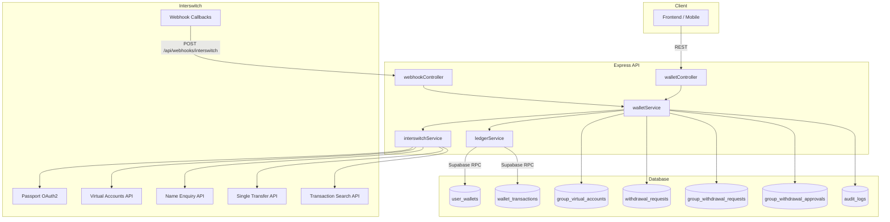
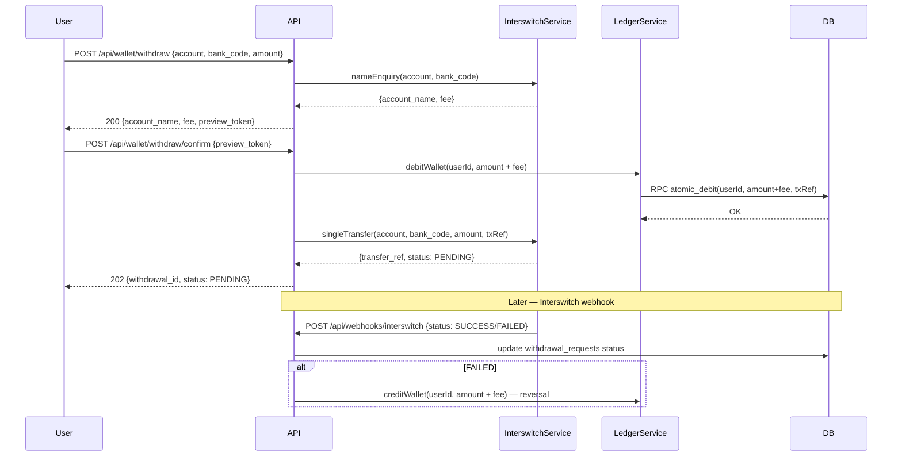
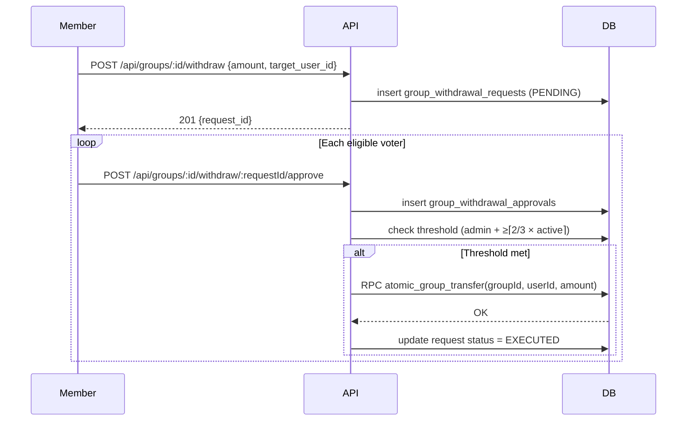

# Design Document: Group & Individual Wallet System

## Overview

The Group & Individual Wallet System introduces a Hybrid Ledger model to the Microfams platform. Real-world money movements (inbound collections via Virtual NUBAN, outbound bank transfers) are handled through the Interswitch API ecosystem. Internal movements (group-to-user, user-to-user P2P) are pure atomic database ledger operations with no external API calls and no fees.

The existing Paystack integration is untouched. Paystack continues to handle bookings, group entry fees, and contribution payments. Interswitch handles all wallet flows described here.

### Key Design Decisions

- **Hybrid Ledger**: External money enters/exits via Interswitch; internal movements are free, instant, and atomic via Supabase RPC.
- **Immutable Ledger**: `wallet_transactions` is append-only. Corrections are compensating transactions, never updates.
- **Idempotent Webhooks**: Every inbound webhook is deduplicated by Interswitch transaction reference before any balance change.
- **Two-Step Withdrawal**: Name enquiry + fee preview (step 1) → user confirmation → debit + transfer initiation (step 2).
- **Multi-Sig Group Withdrawals**: Group-to-individual transfers require Group_Admin approval plus ≥ ⌈2/3 × active_members⌉ votes before the ledger executes.
- **Sandbox-First**: All Interswitch credentials and base URLs are environment-variable-driven to allow sandbox → production promotion without code changes.

---

## Architecture



### Request Flow: Individual Withdrawal (Two-Step)



### Request Flow: Group Withdrawal (Multi-Sig)



---

## Components and Interfaces

### interswitchService.ts

Responsible for all Interswitch API communication. Manages OAuth2 token lifecycle with in-memory caching.

```typescript
interface TokenCache {
  accessToken: string;
  expiresAt: number; // Unix ms, already minus 60s buffer
}

class InterswitchService {
  // OAuth2 — Passport API
  getAccessToken(): Promise<string>

  // Virtual Accounts
  provisionVirtualAccount(groupId: string, groupName: string): Promise<{
    nuban: string;
    bankName: string;
    interswitchRef: string;
  }>

  // Name Enquiry
  nameEnquiry(accountNumber: string, bankCode: string): Promise<{
    accountName: string;
    bankCode: string;
  }>

  // Single Transfer
  singleTransfer(params: {
    accountNumber: string;
    bankCode: string;
    amount: number; // kobo
    reference: string;
    narration: string;
  }): Promise<{ transferRef: string; status: 'PENDING' | 'SUCCESS' | 'FAILED' }>

  // Transaction Search
  queryTransactionStatus(reference: string): Promise<{
    status: 'PENDING' | 'SUCCESS' | 'FAILED';
    amount: number;
  }>

  // Webhook verification
  verifyWebhookSignature(payload: string, signature: string): boolean
}
```

### ledgerService.ts

All balance mutations go through this service. Every method calls a Supabase RPC function that executes the balance update and ledger insert atomically in a single PostgreSQL transaction.

```typescript
class LedgerService {
  // Credit a wallet (COLLECTION, INTERNAL_TRANSFER credit leg, reversal)
  creditWallet(params: {
    walletId: string;
    amount: number;
    type: TransactionType;
    reference: string;
    sourceId?: string;
    metadata?: Record<string, unknown>;
  }): Promise<WalletTransaction>

  // Debit a wallet (WITHDRAWAL, INTERNAL_TRANSFER debit leg, P2P debit leg)
  debitWallet(params: {
    walletId: string;
    amount: number;
    type: TransactionType;
    reference: string;
    destinationId?: string;
    metadata?: Record<string, unknown>;
  }): Promise<WalletTransaction>

  // Atomic P2P: debit sender + credit recipient in one RPC call
  atomicP2PTransfer(params: {
    senderWalletId: string;
    recipientWalletId: string;
    amount: number;
    reference: string;
  }): Promise<{ debitTx: WalletTransaction; creditTx: WalletTransaction }>

  // Atomic group-to-individual: debit group_fund_balance + credit user_wallets
  atomicGroupTransfer(params: {
    groupId: string;
    recipientWalletId: string;
    amount: number;
    reference: string;
    approvalRequestId: string;
  }): Promise<{ debitTx: WalletTransaction; creditTx: WalletTransaction }>
}
```

### walletService.ts

Business logic layer. Enforces limits, validates inputs, orchestrates interswitchService and ledgerService calls.

```typescript
class WalletService {
  // Provisioning
  provisionUserWallet(userId: string): Promise<UserWallet>
  provisionGroupNuban(groupId: string, groupName: string): Promise<GroupVirtualAccount>
  retryNubanProvisioning(groupId: string): Promise<void> // called by cron on PENDING groups

  // Balance & history
  getWalletWithHistory(userId: string, page: number, limit: number): Promise<WalletWithHistory>
  getGroupWallet(groupId: string, requestingUserId: string): Promise<GroupWalletInfo>

  // P2P
  initiateP2PTransfer(senderId: string, recipientId: string, amount: number): Promise<WalletTransaction>

  // Individual withdrawal (two-step)
  previewWithdrawal(userId: string, accountNumber: string, bankCode: string, amount: number): Promise<WithdrawalPreview>
  confirmWithdrawal(userId: string, previewToken: string): Promise<WithdrawalRequest>
  handleWithdrawalWebhook(interswitchRef: string, status: 'SUCCESS' | 'FAILED'): Promise<void>

  // Group withdrawal (multi-sig)
  initiateGroupWithdrawal(groupId: string, requestedBy: string, amount: number, targetUserId: string): Promise<GroupWithdrawalRequest>
  castApprovalVote(requestId: string, voterId: string): Promise<ApprovalResult>
  getGroupWithdrawalRequest(requestId: string): Promise<GroupWithdrawalRequest>

  // Limit checks
  check24hrWithdrawalLimit(userId: string, amount: number): Promise<void>
  check24hrP2PLimit(userId: string, amount: number): Promise<void>

  // Webhook ingress
  handleInterswitchWebhook(payload: string, signature: string): Promise<void>

  // Grace period
  handleGracePeriodExpiry(userId: string): Promise<void>
}
```

### walletController.ts

Thin HTTP handlers. Validates request shape with Joi, delegates to walletService, formats responses.

```typescript
// Individual wallet
getWallet(req, res)           // GET /api/wallet
getTransaction(req, res)      // GET /api/wallet/transactions/:id
initiateP2P(req, res)         // POST /api/wallet/p2p
previewWithdrawal(req, res)   // POST /api/wallet/withdraw
confirmWithdrawal(req, res)   // POST /api/wallet/withdraw/confirm
getWithdrawalStatus(req, res) // GET /api/wallet/withdraw/:id/status

// Group wallet
getGroupWallet(req, res)           // GET /api/groups/:id/wallet
initiateGroupWithdrawal(req, res)  // POST /api/groups/:id/withdraw
castApprovalVote(req, res)         // POST /api/groups/:id/withdraw/:requestId/approve
getGroupWithdrawalRequest(req, res)// GET /api/groups/:id/withdraw/:requestId

// Webhook
interswitchWebhook(req, res)  // POST /api/webhooks/interswitch
```

### walletJobs.ts

Two cron jobs:

1. **Pending withdrawal timeout** (runs every hour): Queries `withdrawal_requests` where `status = PENDING` and `created_at < NOW() - INTERVAL '24 hours'`. For each, calls `interswitchService.queryTransactionStatus()` and updates accordingly.
2. **Grace period expiry** (runs daily at 02:00): Queries `users` where `account_status IN ('suspended', 'deleted')` and `grace_period_ends_at < NOW()` and `wallet_balance > 0`. For each, calls `walletService.handleGracePeriodExpiry()`.

---

## Data Models

### user_wallets

```sql
CREATE TABLE user_wallets (
  id            UUID PRIMARY KEY DEFAULT uuid_generate_v4(),
  user_id       UUID NOT NULL UNIQUE REFERENCES users(id) ON DELETE CASCADE,
  balance       NUMERIC(15,2) NOT NULL DEFAULT 0.00 CHECK (balance >= 0),
  status        VARCHAR(20) NOT NULL DEFAULT 'ACTIVE'
                  CHECK (status IN ('ACTIVE', 'SUSPENDED', 'FROZEN')),
  created_at    TIMESTAMPTZ NOT NULL DEFAULT NOW(),
  updated_at    TIMESTAMPTZ NOT NULL DEFAULT NOW()
);
CREATE INDEX idx_user_wallets_user_id ON user_wallets(user_id);
```

### wallet_transactions

```sql
CREATE TABLE wallet_transactions (
  id             UUID PRIMARY KEY DEFAULT uuid_generate_v4(),
  wallet_id      UUID NOT NULL REFERENCES user_wallets(id),
  source_id      UUID,   -- wallet_id or group_id depending on type
  destination_id UUID,   -- wallet_id or group_id depending on type
  amount         NUMERIC(15,2) NOT NULL CHECK (amount > 0),
  type           VARCHAR(30) NOT NULL
                   CHECK (type IN ('COLLECTION','INTERNAL_TRANSFER','WITHDRAWAL','P2P_TRANSFER')),
  direction      VARCHAR(10) NOT NULL CHECK (direction IN ('CREDIT','DEBIT')),
  status         VARCHAR(20) NOT NULL CHECK (status IN ('PENDING','SUCCESS','FAILED')),
  reference      VARCHAR(100) NOT NULL,
  metadata       JSONB,
  created_at     TIMESTAMPTZ NOT NULL DEFAULT NOW()
);
-- Immutability enforced via RLS: no UPDATE or DELETE allowed on this table
CREATE INDEX idx_wallet_txns_wallet_id  ON wallet_transactions(wallet_id);
CREATE INDEX idx_wallet_txns_reference  ON wallet_transactions(reference);
CREATE INDEX idx_wallet_txns_created_at ON wallet_transactions(created_at);
```

### group_virtual_accounts

```sql
CREATE TABLE group_virtual_accounts (
  id               UUID PRIMARY KEY DEFAULT uuid_generate_v4(),
  group_id         UUID NOT NULL UNIQUE REFERENCES groups(id) ON DELETE CASCADE,
  nuban            VARCHAR(20),
  bank_name        VARCHAR(100),
  interswitch_ref  VARCHAR(100),
  status           VARCHAR(20) NOT NULL DEFAULT 'PENDING'
                     CHECK (status IN ('PENDING','ACTIVE','FAILED')),
  retry_count      INTEGER NOT NULL DEFAULT 0,
  created_at       TIMESTAMPTZ NOT NULL DEFAULT NOW(),
  updated_at       TIMESTAMPTZ NOT NULL DEFAULT NOW()
);
CREATE INDEX idx_gva_group_id ON group_virtual_accounts(group_id);
CREATE INDEX idx_gva_nuban    ON group_virtual_accounts(nuban);
```

### withdrawal_requests

```sql
CREATE TABLE withdrawal_requests (
  id                UUID PRIMARY KEY DEFAULT uuid_generate_v4(),
  user_id           UUID NOT NULL REFERENCES users(id),
  wallet_id         UUID NOT NULL REFERENCES user_wallets(id),
  amount            NUMERIC(15,2) NOT NULL CHECK (amount >= 1000),
  fee_amount        NUMERIC(15,2) NOT NULL DEFAULT 0,
  account_number    VARCHAR(20) NOT NULL,
  bank_code         VARCHAR(10) NOT NULL,
  account_name      VARCHAR(200) NOT NULL,
  status            VARCHAR(20) NOT NULL DEFAULT 'PENDING'
                      CHECK (status IN ('PENDING','SUCCESS','FAILED')),
  interswitch_ref   VARCHAR(100),
  internal_ref      VARCHAR(100) NOT NULL UNIQUE,
  failure_reason    TEXT,
  created_at        TIMESTAMPTZ NOT NULL DEFAULT NOW(),
  updated_at        TIMESTAMPTZ NOT NULL DEFAULT NOW()
);
CREATE INDEX idx_wr_user_id    ON withdrawal_requests(user_id);
CREATE INDEX idx_wr_status     ON withdrawal_requests(status);
CREATE INDEX idx_wr_created_at ON withdrawal_requests(created_at);
```

### group_withdrawal_requests

```sql
CREATE TABLE group_withdrawal_requests (
  id             UUID PRIMARY KEY DEFAULT uuid_generate_v4(),
  group_id       UUID NOT NULL REFERENCES groups(id),
  requested_by   UUID NOT NULL REFERENCES users(id),
  target_user_id UUID NOT NULL REFERENCES users(id),
  amount         NUMERIC(15,2) NOT NULL CHECK (amount > 0),
  status         VARCHAR(20) NOT NULL DEFAULT 'PENDING'
                   CHECK (status IN ('PENDING','APPROVED','FAILED','EXECUTED')),
  failure_reason TEXT,
  created_at     TIMESTAMPTZ NOT NULL DEFAULT NOW(),
  updated_at     TIMESTAMPTZ NOT NULL DEFAULT NOW()
);
CREATE INDEX idx_gwr_group_id ON group_withdrawal_requests(group_id);
CREATE INDEX idx_gwr_status   ON group_withdrawal_requests(status);
```

### group_withdrawal_approvals

```sql
CREATE TABLE group_withdrawal_approvals (
  id                  UUID PRIMARY KEY DEFAULT uuid_generate_v4(),
  approval_request_id UUID NOT NULL REFERENCES group_withdrawal_requests(id) ON DELETE CASCADE,
  voter_id            UUID NOT NULL REFERENCES users(id),
  voted_at            TIMESTAMPTZ NOT NULL DEFAULT NOW(),
  UNIQUE(approval_request_id, voter_id)
);
CREATE INDEX idx_gwa_request_id ON group_withdrawal_approvals(approval_request_id);
```

### Supabase RPC Functions (atomicity)

All balance mutations are executed via PostgreSQL functions called through `supabase.rpc()`. This ensures the balance update and ledger insert are in the same transaction and either both commit or both roll back.

```sql
-- Atomic P2P transfer
CREATE OR REPLACE FUNCTION atomic_p2p_transfer(
  p_sender_wallet_id   UUID,
  p_recipient_wallet_id UUID,
  p_amount             NUMERIC,
  p_reference          VARCHAR
) RETURNS JSONB ...

-- Atomic group-to-individual transfer
CREATE OR REPLACE FUNCTION atomic_group_transfer(
  p_group_id           UUID,
  p_recipient_wallet_id UUID,
  p_amount             NUMERIC,
  p_reference          VARCHAR,
  p_approval_request_id UUID
) RETURNS JSONB ...

-- Atomic wallet debit (withdrawal step)
CREATE OR REPLACE FUNCTION atomic_wallet_debit(
  p_wallet_id  UUID,
  p_amount     NUMERIC,
  p_type       VARCHAR,
  p_reference  VARCHAR,
  p_metadata   JSONB DEFAULT NULL
) RETURNS UUID ...

-- Atomic wallet credit (collection, reversal)
CREATE OR REPLACE FUNCTION atomic_wallet_credit(
  p_wallet_id  UUID,
  p_amount     NUMERIC,
  p_type       VARCHAR,
  p_reference  VARCHAR,
  p_metadata   JSONB DEFAULT NULL
) RETURNS UUID ...
```

---

## Correctness Properties

*A property is a characteristic or behavior that should hold true across all valid executions of a system — essentially, a formal statement about what the system should do. Properties serve as the bridge between human-readable specifications and machine-verifiable correctness guarantees.*

### Property 1: Ledger Balance Invariant

*For any* wallet with any number of completed transactions, the sum of all CREDIT transaction amounts minus the sum of all DEBIT transaction amounts in `wallet_transactions` must equal the current `balance` stored in `user_wallets` (or `groups.group_fund_balance` for group wallets).

**Validates: Requirements 8.5**

---

### Property 2: Webhook Idempotency

*For any* Interswitch transaction reference that has already been processed to a terminal state (SUCCESS or FAILED), submitting the same webhook payload a second time must leave all wallet balances and `wallet_transactions` records unchanged.

**Validates: Requirements 3.5**

---

### Property 3: Webhook HMAC Validation

*For any* webhook payload, if the HMAC-SHA512 signature computed with `INTERSWITCH_WEBHOOK_SECRET` does not match the `x-interswitch-signature` header, the system must return HTTP 400 and no balance must change. If the signature is valid, the group wallet must be credited by exactly the amount in the payload.

**Validates: Requirements 3.1, 3.2, 3.3**

---

### Property 4: Internal Transfer Atomicity

*For any* internal transfer (P2P or group-to-individual), either both the source balance decreases and the destination balance increases by exactly the transfer amount, or neither balance changes. There must be no state where one side has changed and the other has not.

**Validates: Requirements 4.4, 4.7, 6.5, 6.7, 8.3**

---

### Property 5: Approval Threshold Invariant

*For any* group withdrawal request, the `atomic_group_transfer` RPC must not execute unless: (a) the Group_Admin has cast an approval vote, AND (b) the total approval count is ≥ ⌈2/3 × active_member_count⌉. A request with fewer approvals must remain in `PENDING` status regardless of how many non-admin votes have been cast.

**Validates: Requirements 4.2**

---

### Property 6: 24-Hour Withdrawal Limit

*For any* user and any rolling 24-hour window, the sum of all `WITHDRAWAL` type debits from that user's wallet must not exceed ₦100,000. Any withdrawal request that would cause the cumulative total to exceed this limit must be rejected before any balance change occurs.

**Validates: Requirements 5.4**

---

### Property 7: 24-Hour P2P Limit

*For any* user and any rolling 24-hour window, the sum of all outbound `P2P_TRANSFER` type debits from that user's wallet must not exceed ₦50,000. Any P2P transfer that would cause the cumulative total to exceed this limit must be rejected before any balance change occurs.

**Validates: Requirements 6.3**

---

### Property 8: Insufficient Funds Rejection

*For any* debit operation (withdrawal, P2P transfer, group transfer debit leg), if the operation amount exceeds the current wallet balance, the operation must be rejected and the wallet balance must remain unchanged. No wallet balance may ever go below zero.

**Validates: Requirements 4.5, 5.5, 6.4**

---

### Property 9: Input Validation Rejection

*For any* wallet operation request containing invalid inputs — including negative amounts, amounts below the minimum threshold, non-numeric account numbers, or missing required fields — the system must reject the request with a 4xx error before any balance change or external API call occurs.

**Validates: Requirements 5.3, 6.2, 11.1**

---

### Property 10: Wallet Provisioning Uniqueness

*For any* newly registered user, exactly one `user_wallets` record must exist with `balance = 0.00` and `status = ACTIVE`. Calling the provisioning logic multiple times for the same user must not create duplicate wallet records.

**Validates: Requirements 7.1, 7.2**

---

### Property 11: NUBAN Uniqueness and Immutability

*For any* group with an `ACTIVE` NUBAN in `group_virtual_accounts`, subsequent calls to the provisioning logic must not create a new record or change the existing NUBAN. Each group must have at most one `ACTIVE` NUBAN at any time.

**Validates: Requirements 2.5**

---

### Property 12: Audit Log Completeness

*For any* wallet operation that reaches the execution stage (initiation, approval vote, execution, failure, reversal), an entry must exist in `audit_logs` containing the acting user's ID, the request IP address, and the action type.

**Validates: Requirements 11.2**

---

### Property 13: Admin Role Enforcement

*For any* request to a wallet administration endpoint (balance adjustment, manual status override) made by a user whose JWT role is not `admin`, the system must return HTTP 403 and must not modify any data.

**Validates: Requirements 11.6**

---

### Property 14: Withdrawal Reversal on Failure

*For any* `withdrawal_requests` record that transitions to `FAILED` status (via webhook or timeout resolution), the user's wallet balance must be restored to exactly the value it held before the withdrawal was initiated (i.e., the debited amount plus fee must be credited back).

**Validates: Requirements 5.9**

---

### Property 15: Suspended User Inbound Block

*For any* user whose `user_wallets.status` is `SUSPENDED`, any inbound transfer operation (P2P credit or group-to-individual credit) targeting that wallet must be rejected before any balance change occurs.

**Validates: Requirements 9.2**

---

## Error Handling

### Interswitch API Errors

| Scenario | Behaviour |
|---|---|
| Passport token fetch fails | Throw `InterswitchAuthError`, log with timestamp, propagate to caller |
| Virtual Account provisioning fails | Set `group_virtual_accounts.status = PENDING`, schedule retry (exponential backoff: 1min, 2min, 4min) |
| Name Enquiry returns invalid account | Return 422 to client with bank error message; no debit |
| Single Transfer API error | Withdrawal_Request stays PENDING; cron job resolves after 24hr |
| Transaction Search API error | Log error, leave status unchanged; retry on next cron cycle |

### Webhook Errors

| Scenario | Behaviour |
|---|---|
| Invalid HMAC signature | Return HTTP 400, log rejected event with payload hash |
| Duplicate reference | Return HTTP 200, no-op |
| Unknown NUBAN in payload | Return HTTP 200, log warning for manual review |
| DB error during credit | Return HTTP 500, Interswitch will retry; idempotency key prevents double-credit |

### Ledger Errors

| Scenario | Behaviour |
|---|---|
| Insufficient funds | Throw `InsufficientFundsError` (400), no DB write |
| RPC transaction failure | PostgreSQL rolls back atomically; throw `LedgerTransactionError` (500) |
| Approval threshold not met | Return 202 with current vote count; no execution |
| Group balance insufficient at execution | Set `group_withdrawal_requests.status = FAILED`, notify Group_Admin |

### Rate Limiting

Wallet endpoints use a dedicated rate limiter: 10 requests per user per 15-minute window. Exceeding the limit returns HTTP 429. This is applied at the route level using `express-rate-limit` keyed by `req.user.id`.

---

## Testing Strategy

### Dual Testing Approach

Both unit tests and property-based tests are required. They are complementary:
- Unit tests catch concrete bugs in specific scenarios and integration points.
- Property-based tests verify universal correctness across randomized inputs.

### Property-Based Testing

The project already uses **fast-check** (v4.6.0, confirmed in `package.json`). Each correctness property from this document must be implemented as a single fast-check property test.

**Configuration**: Each property test must run a minimum of 100 iterations (`numRuns: 100`).

**Tag format** (comment above each test):
```
// Feature: group-individual-wallet-system, Property N: <property_text>
```

**Property test file**: `backend/src/tests/wallet-properties.test.ts`

| Property | Test Description | fast-check Arbitraries |
|---|---|---|
| P1: Ledger Balance Invariant | Generate random sequences of credits/debits, verify sum equals balance | `fc.array(fc.record({type, amount, direction}))` |
| P2: Webhook Idempotency | Generate valid webhook payloads, process twice, verify no balance change on second | `fc.record({reference, amount})` |
| P3: Webhook HMAC Validation | Generate payloads with valid/invalid signatures, verify accept/reject | `fc.string()`, `fc.boolean()` |
| P4: Internal Transfer Atomicity | Generate transfer amounts, mock DB failure mid-transfer, verify both balances unchanged | `fc.integer({min:100, max:50000})` |
| P5: Approval Threshold | Generate group sizes 1–50, generate vote counts below/at/above threshold, verify execution only at threshold | `fc.integer({min:1, max:50})` |
| P6: 24hr Withdrawal Limit | Generate sequences of withdrawals summing to various totals, verify rejection at >100k | `fc.array(fc.integer({min:1000, max:50000}))` |
| P7: 24hr P2P Limit | Generate sequences of P2P transfers, verify rejection at >50k | `fc.array(fc.integer({min:100, max:25000}))` |
| P8: Insufficient Funds | Generate wallet balance and transfer amount where amount > balance, verify rejection | `fc.tuple(fc.integer({min:0}), fc.integer({min:1}))` |
| P9: Input Validation | Generate invalid inputs (negative amounts, empty strings, below-minimum amounts), verify 4xx | `fc.oneof(fc.integer({max:-1}), fc.constant(0), fc.string())` |
| P10: Wallet Provisioning Uniqueness | Generate user IDs, call provision multiple times, verify exactly one wallet record | `fc.uuid()` |
| P11: NUBAN Uniqueness | Generate group IDs, call provision multiple times, verify exactly one ACTIVE NUBAN | `fc.uuid()` |
| P12: Audit Log Completeness | Generate wallet operations, verify audit log entry exists after each | `fc.record({userId, action, amount})` |
| P13: Admin Role Enforcement | Generate non-admin JWT tokens, call admin endpoints, verify 403 | `fc.constantFrom('farmer','owner')` |
| P14: Withdrawal Reversal | Generate withdrawal amounts, simulate FAILED webhook, verify balance restored | `fc.integer({min:1000, max:100000})` |
| P15: Suspended User Inbound Block | Generate inbound transfer to suspended wallet, verify rejection | `fc.record({senderId, recipientId, amount})` |

### Unit Tests

**Unit test file**: `backend/src/tests/wallet.test.ts`

Focus areas:
- `interswitchService`: token caching (fresh token reused, expired token refreshed), HMAC verification with known vectors
- `walletService.previewWithdrawal`: fee calculation, minimum amount enforcement, name enquiry error propagation
- `walletService.castApprovalVote`: threshold calculation for various group sizes (1, 2, 3, 6, 10 members)
- `walletService.handleGracePeriodExpiry`: penalty deduction before transfer, no-group-membership flag path
- Webhook handler: valid COLLECTION event credits group, duplicate reference is no-op
- Route auth: unauthenticated requests return 401, wrong-role requests return 403

### Integration Tests

**Integration test file**: `backend/src/tests/wallet-integration.test.ts`

- Full withdrawal flow: preview → confirm → SUCCESS webhook → balance settled
- Full P2P flow: initiate → atomic transfer → both balances updated
- Group withdrawal flow: initiate → votes → threshold met → executed
- NUBAN provisioning retry: first call fails → PENDING → retry succeeds → ACTIVE
